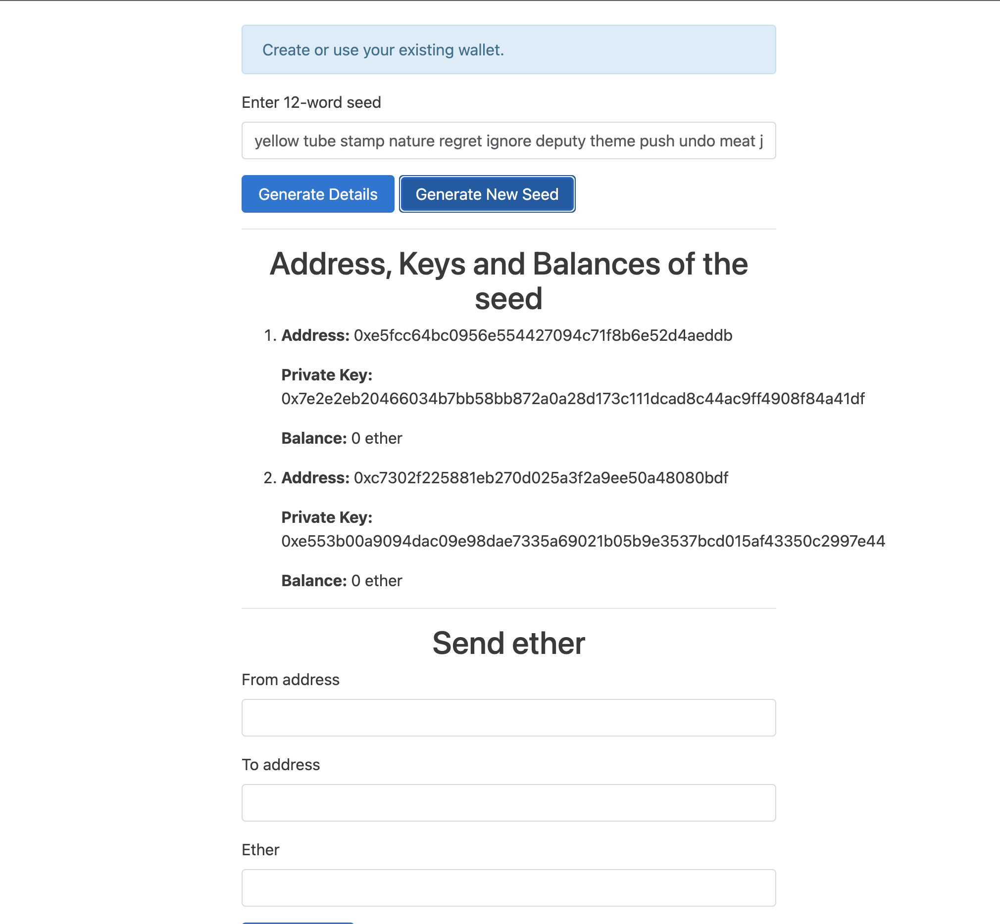

### Prerequisites
make sure that you are running the geth development instance, which is mining, has the HTTP-RPC server enabled, allows client-side requests from any domain, and finally has account 0 unlocked. You can do all these by running this:

`geth --dev --http --http.api "eth,net,web3,personal" --http.corsdomain "*" --http.addr "0.0.0.0" --http.port "8545" --mine`

In this command:

--http.api "eth,net,web3,personal" specifies which APIs are accessible over HTTP. The "personal" API is used for account management.
--http.corsdomain "*" allows access from any domain.
--http.addr "0.0.0.0" and --http.port "8545" set the address and port for the HTTP interface.
--mine is for mining.

run also `npm install`

### Project Structure
you will find a public directory and two files named app.js and package.json. package.json contains the backend dependencies. 
The public directory contains files related to the frontend. Inside public/css, you will find bootstrap.min.css, which is the bootstrap library. Inside public/html, you will find index.html, where we place the HTML code of our app, and finally, in the public/js directory, you will find .js files for Hooked-Web3-Provider, web3js, and LightWallet. Inside public/js, you will also find a main.js file where we place the frontend JS code of our app.

### About Index.html
At first, we enqueue a Bootstrap 4 stylesheet.
Then we display an information box, where we will display various messages to the user.
And then we have a form with an input box and two buttons. The input box is used to enter the seed, or while generating new seed, the seed is displayed there.
The Generate Details button is used to display addresses and Generate New Seed is used to generate a new unique seed. When Generate Details is clicked, we call the generate_addresses() method, and when the Generate New Seed button is clicked, we call the generate_seed() method.
Later, we have an empty ordered list. Here, we will dynamically display the addresses, their balances, and associated private keys of a seed when a user clicks on the Generate Details button.
Finally, we have another form that takes a from address and a to address and the amount of ether to transfer. The from address must be one of the addresses that's currently displayed in the unordered list.

### About Main.js
The generateRandomSeed() method of the keystore namespace is used to generate a random seed. It takes an optional parameter, which is a string that indicates the extra entropy.

Entropy is the randomness collected by an application for use in some algorithm or somewhere else that requires random data. Usually, entropy is collected from hardware sources, either pre-existing ones such as mouse movements or specially provided randomness generators.
To produce a unique seed, we need really high entropy. LightWallet is already built with methods to produce unique seeds. The algorithm LightWallet uses to produce entropy depends on the environment.

After generating a random seed, we call the generate_addresses method. This method takes a seed and displays addresses in it. Before generating addresses, it prompts the user to ask how many addresses they want.

### generate address function

Here is how the code works:

At first, we have a variable named totalAddresses, which holds a number indicating the total number of addresses the user wants to generate.
Then we check whether the seed parameter is defined or not. If it's undefined, we fetch the seed from the input field. We are doing this so that the generate_addressess() method can be used to display the information seed while generating a new seed and also if the user clicks on the Generate Details button.
Then we validate the seed using the isSeedValid() method of the keystore namespace.
We then ask for the user's input regarding how many addresses they want to generate and display. And then we validate the input.
The private keys in the keystore namespace are always stored encrypted. While generating keys, we need to encrypt them, and while signing transactions, we need to decrypt the keys. The password for deriving a symmetric encryption key can be taken as input from the user or by supplying a random string as a password. For better user experience, we generate a random string and use it as the password. The symmetric key is not stored inside the keystore namespace; therefore, we need to generate the key from the password whenever we do operations related to the private key, such as generating keys, accessing keys, and so on.
Then we use the createVault method to create a keystore instance. createVault takes an object and a callback. The object can have four properties: password, seedPharse, salt, and hdPathString. password is compulsory, and everything else is optional. If we don't provide a seedPharse, it will generate and use a random seed. salt is concatenated to the password to increase the security of the symmetric key as the attacker has to also find the salt along with the password. If the salt is not provided, it's randomly generated. The keystore namespace holds the salt unencrypted. hdPathString is used to provide the default derivation path for the keystore namespace, that is, while generating addresses, signing transactions, and so on. If we don't provide a derivation path, then this derivation path is used. If we don't provide hdPathString, then the default value is m/0'/0'/0'. The default purpose of this derivation path is sign. You can create new derivation paths or overwrite the purpose of derivation paths present using the addHdDerivationPath() method of a keystore instance. You can also change the default derivation path using the setDefaultHdDerivationPath() method of a keystore instance. Finally, once the keystore namespace is created, the instance is returned via the callback. So here, we created a keystore using a password and seed only.
Now we need to generate the number of addresses and their associated keys the user needs. As we can generate millions of addresses from a seed, keystore doesn't generate any address until we want it to because it doesn't know how many addresses we want to generate. After creating the keystore, we generate the symmetric key from the password using the keyFromPassword method. And then we call the generateNewAddress() method to generate addresses and their associated keys.
generateNewAddress() takes three arguments: password derived key, number of addresses to generate, and derivation path. As we haven't provided a derivation path, it uses the default derivation path of the keystore. If you call generateNewAddress() multiple times, it resumes from the address it created in the last call. For example, if you call this method twice, each time generating two addresses, you will have the first four addresses.
Then we use getAddresses() to get all the addresses stored in the keystore.
We decrypt and retrieve private keys of the addresses using the exportPrivateKey method.
We use web3.eth.getBalance() to get balances of the address.
And finally, we display all the information inside the unordered list.

Now we know how to generate the address and their private keys from a seed. Now let's write the implementation of the send_ether() method, which is used to send ether from one of the addresses generated from the seed.

Here, the code up and until generating addresses from the seed is self explanatory. After that, we assign a callback to the passwordProvider property of ks. This callback is invoked during transaction signing to get the password to decrypt the private key. If we don't provide this, LightWallet prompts the user to enter the password. And then, we create a HookedWeb3Provider instance by passing the keystore as the transaction signer. Now when the custom provider wants a transaction to be signed, it calls the hasAddress and signTransactions methods of ks. If the address to be signed is not among the generated addresses, ks will give an error to the custom provider. And finally, we send some ether using the web3.eth.sendTransaction method.

### Demo
